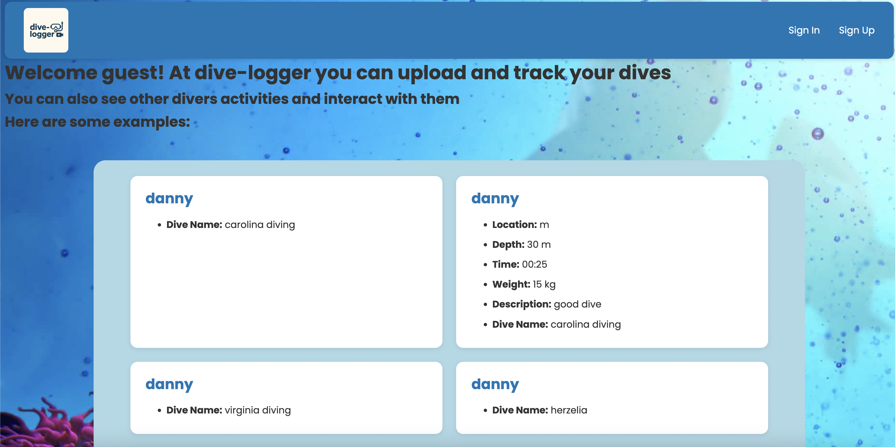

# Dive log - a dive record keeping app

### Why

I built this [app](https://dive-logger.onrender.com) sice I used to be an avid _diver_ back in the day, and with my _diving_ days about to make A comeback I realised there is no really good app to keep record of your _dives_, so I decided to build one!\
The app can keep track of basic _dive_ details, and store it on your profile. In addition it has A **social** functionality to it, you can see other users' dives and profiles.

### Tools and getting started

The app is deployed [here](https://dive-logger.onrender.com).\
For planning, I layed out my requirements and divided the work over the week different days, I used [trello](https://trello.com/b/bTE895fK/diving-log-book) to make all my plans, focusing on having a really solid ground to the functionality and looks, and from there see what i can expand on.

### Attributions

I did not use and external technologies on this project, except for the basic layout of the css file, which I used ChatGPT to class and id items for a smoother ux design process.

### Technologies used

- MongoDB – NoSQL database for storing your application’s data.

- Mongoose – ODM (Object Data Modeling) library that provides a structured way to interact with MongoDB using schemas and models.

- Express.js – Web framework for building routes, middleware, and APIs on top of Node.js.

- Node.js – JavaScript runtime for running server-side code.

- EJS (Embedded JavaScript) – Templating engine to render dynamic HTML views.

- JavaScript (frontend) – Client-side interactivity in the browser.

- HTML/CSS – Structure and styling of your pages.

- bcrypt – Library for hashing passwords securely.

- express-session – Middleware for managing user sessions (login persistence).

- connect-mongo – Stores session data in MongoDB so sessions persist across server restarts.

- dotenv – Loads environment variables from a .env file into process.env for configuration.

- method-override – Allows using HTTP verbs like PUT or DELETE where the client or forms don’t support them.

- morgan – HTTP request logger for easier debugging during development.

## next steps

My stretch goals are listed out on my _Trello_, I only reached onestretch goal that I set for myself at the start of the project so I am definitly going to work more to reach at least another one.

- See overall time underwater
- Have a gear model that you can upload gear you have to your profile, and then list out what gear you used on what dives to keep track how many dives you have with each piece of gear
- Map API that allows you to enter where the dive took place and have that map with the pin show up on the dive details, and on the user profile see A map with all dives in pins so you can see every dive you have on the map.
